# Table of Content

- [Pipeline Resource Distribution](#pipeline-resource-distribution)
- [Description](#description)
- [Azure DevOps Details](#azure-devops-details)
  - [Is Azure DevOps Cloud](#is-azure-devops-cloud)
  - [PAT](#pat)
- [Run Type](#run-type)
  - [SourceType](#sourcetype)
  - [Team Projects To Target](#team-projects-to-target)
  - [Commit Message](#commit-message)
  - [Projects](#projects)
  - [Projects to Exclude](#projects-to-exclude)
  - [Folder](#folder)
  - [Files](#files)
- [Deny Contributor Edit Permission](#deny-contributor-edit-permission)
- [Advanced Settings](#advanced-settings)
  - [Increase Verbosity](#increase-verbosity)
  - [Request Throttle](#request-throttle)
- [Compliancy Notes](#compliancy-notes)
- [Security](#security)
- [Get Started](#get-started)
- [Related Topics](#related-topics)
- [Release Notes](#release-notes)
- [Contributors](#contributors)

## Pipeline Resource Distribution

This build pipeline extension provides a way to distribute one or more JSON files representing Task Groups , Variable Groups  and Service Connections  to one or more team projects in the same organisation.

## Description

The extension is called Distribution-Pipelines because, the Task Groups, Variable Groups and Service Connections (JSON files) which it is designed to distribute, contain tasks that together represent standard,compliant build pipelines. The current version of the extension will distribute any valid task group. See *Related Topics* for Task Groups, Variable Groups and Service Connections details. The build pipeline extension allows one or more teams to manage and maintain JSON definitions, which other projects in the same organisation can consume.

Add these tasks to a Build Pipeline and link the pipeline to a repo which contains one or more JSON file definitions - reprsenting task groups, variable groups and service connections. The extension requires a *personal access token* (PAT) of a user with the rights to add and update the resource definitions, as well as setting access control permissions of task groups in all or any team projects in the current organisation. The user should not be a member of any team project. For more details read the section *Security*.

Use a *Hosted Agent* to run the Agent Job.

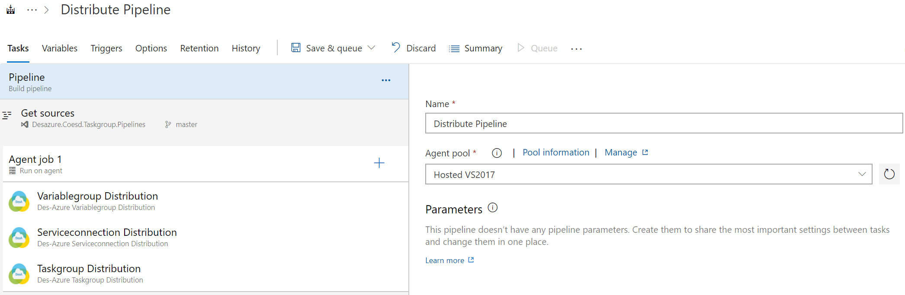

## Azure DevOps Details

### Is Azure DevOps Cloud

This additional option recently added to support Azure DevOps Server i.e. Version 12 of extension. This option would be available in version V3 of Service connection, V8 of task groups and V3 of variable groups.

By default the option in checked to target Azure DevOps cloud only

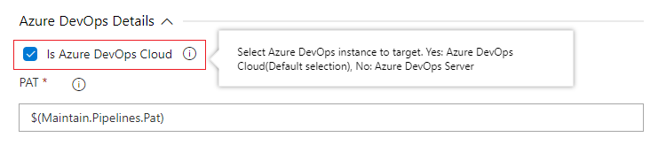

To target Azure DevOps Server, uncheck option, this would display textbox 'Azure DevOps On-premises Url'. Enther the on-premises url. For example: `https://dev.mycompany.azure.com/DefaultCollection/` 

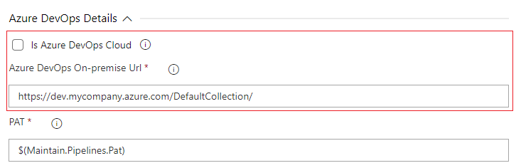

### PAT

A Personal Access Token (PAT) with the correct scopes for creating and updating Taskgroups, Variablegroups and Serviceconnection across this organisation. The default value is the process variable `$(Maintain.Pipelines.Pat)`. Define it, and assign a PAT. The process variable must be a **secret variable**. It is recommended to select **All Scopes** when creating the PAT.

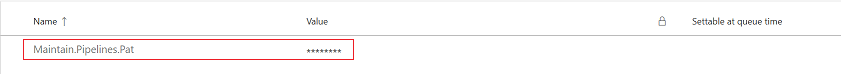

## Run Type

### SourceType

There are two options:

1. **Files** - See the `Files` option
2. **Folder** - See the `Folder` option

### Team Projects To Target

There are three options:

1. **Specific team projects** - See the `Projects` option
2. **All team projects except** - See the `Projects to Exclude` option
3. **All team projects** - to distribute the selected task groups, variable groups and service connection to all team projects in this organisation

### Commit Message

The reason for the change. This would normally be the last commit message. The default value is `$(Build.SourceVersionMessage)`

### Projects

These are the specific team projects to which the selected task group(s), variable group(s) and Service connection(s) will be distributed. If providing multiple teams, use a comma (,) to separate each project name.

### Projects to Exclude

To exclude one or more Azure DevOps Team Projects from the run use this option. If providing multiple teams, use a comma (,) to separate each and quote the names if they contain spaces.

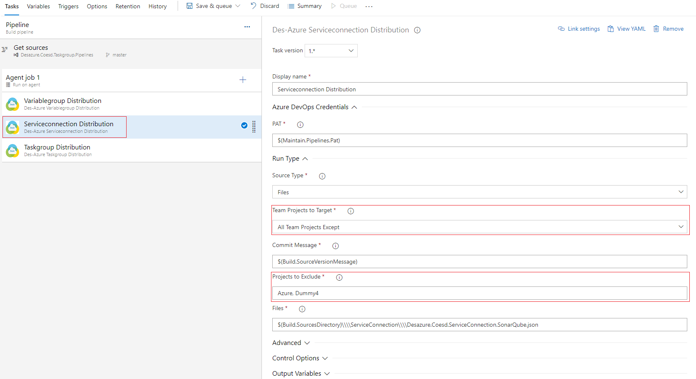

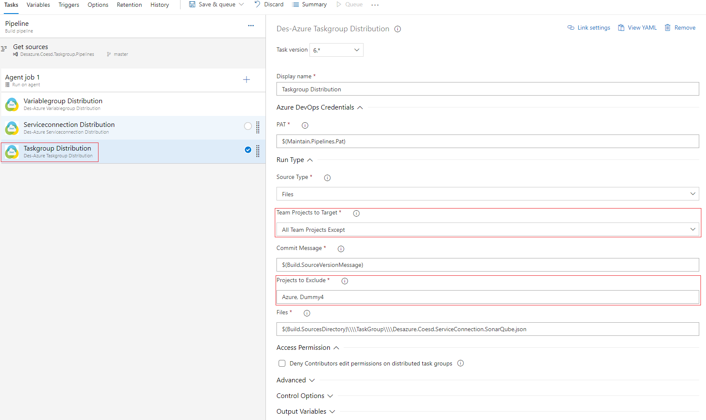

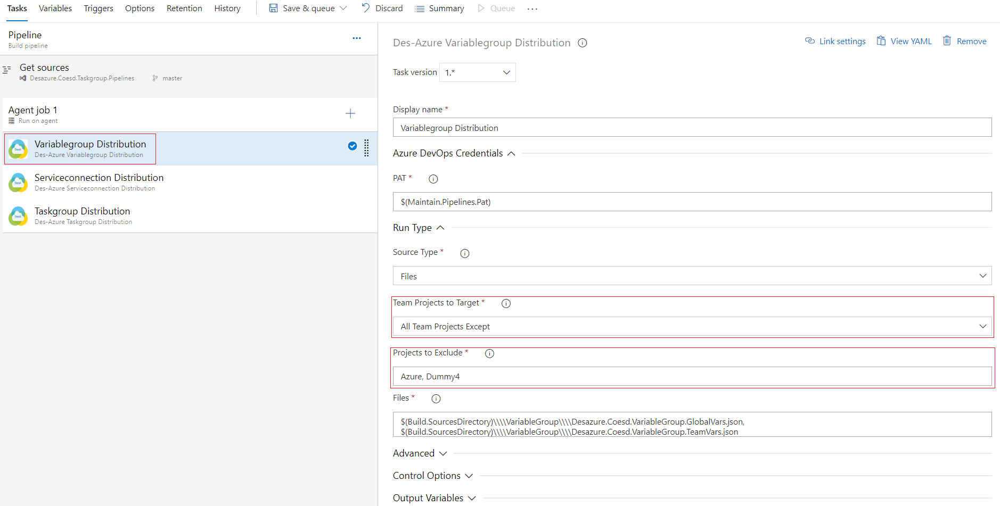

### Folder

This is the name of a single directory. Only valid JSON files in this folder will be included in the run. A task group is deemed to be valid if it conforms to the task group, variable group and service connection specification.

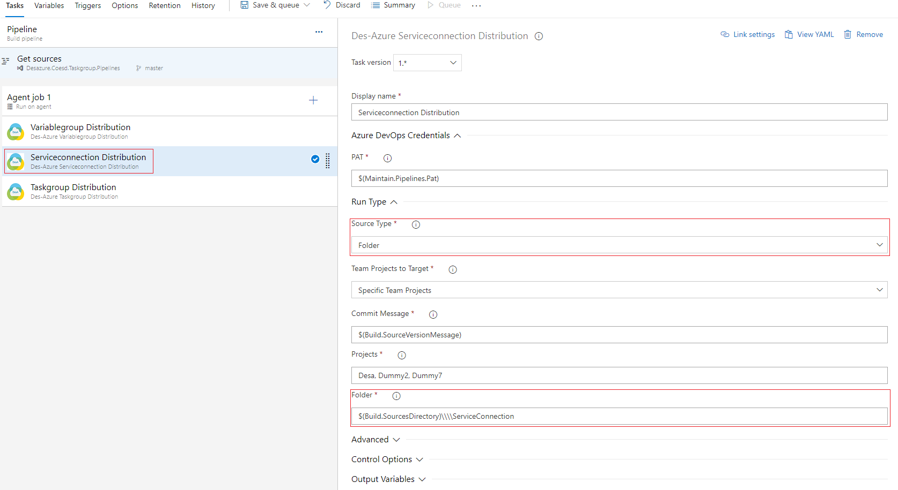

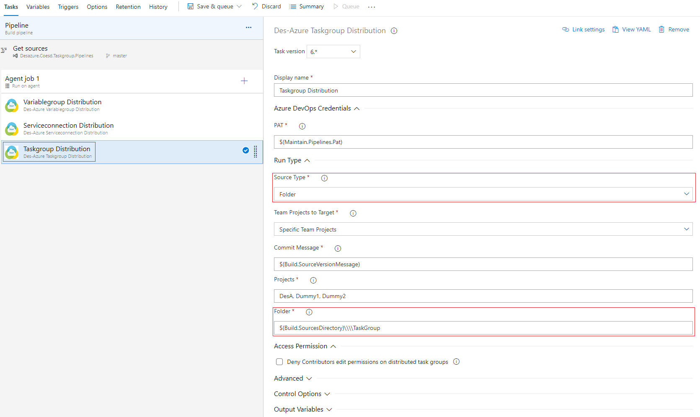

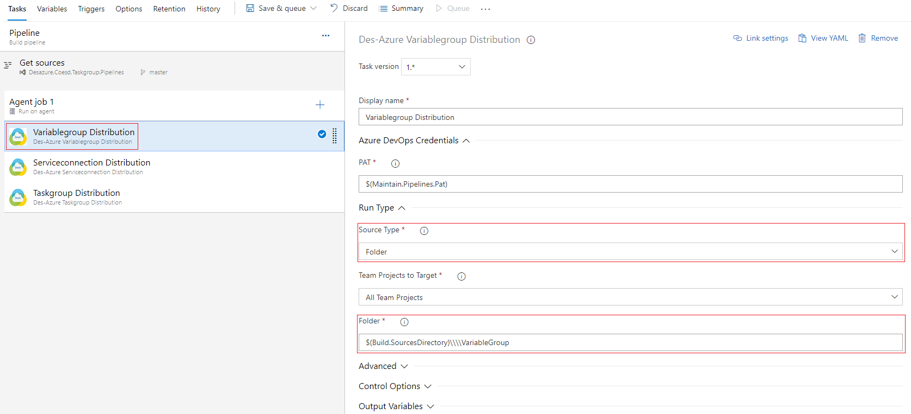

### Files

One or more JSON files containing a valid taskgroup, variablegroup and serviceconnection definition. If the files are not in the same directory as the script they must be fully qualified. If providing multiple files, use a comma (,) to separate each.

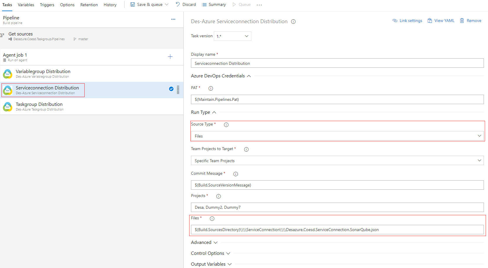

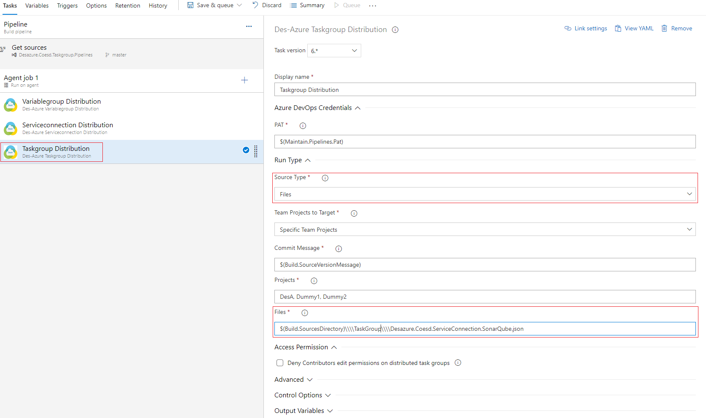

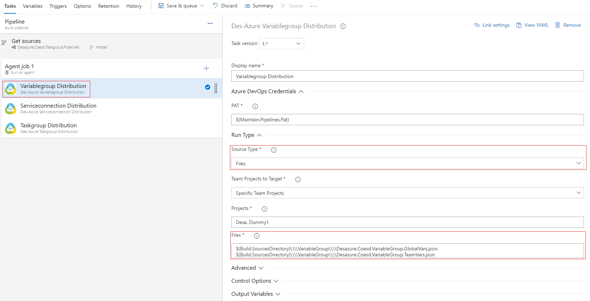

## Deny Contributor Edit Permission

The optional permission parameter used to Deny the Contributor role Edit permission on distributed task groups

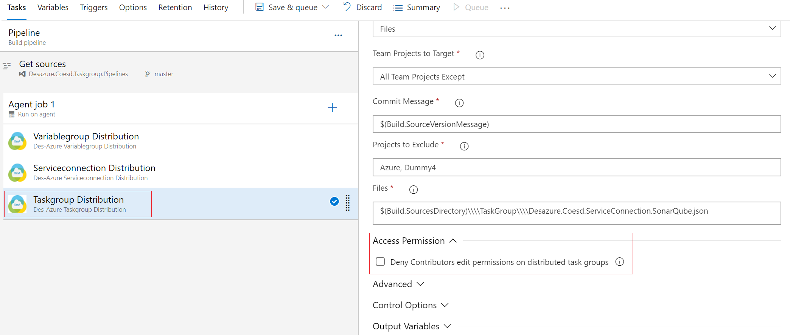

## Advanced Settings

### Increase Verbosity

The extension is quite verbose and logs relevant progress information. If necessary, or preferred, increase verbosity to include addition progress and status information in the logs

### Request Throttle

While updating the access control list (ACL) of the team project *Contributor* group the extension sometimes encounters a situation where the ACL can't be loaded for the current task group. The extension will retry upto 4 times, pasuing each time for the number of seconds specified here. The default wait time is **5** seconds.

## Compliancy Notes

1. Variable group(s) are variables used in pipeline hence distribute them first.
2. Service connections are mentioned in task groups in order to communicate with external system like SonarQube, Splunk etc. hence distribute them before task group distribution.
3. After successful distribution of variable groups and service connection, distribute task groups. 
4. With respect to task groups we have introduced a new attribute `isMinorChange`. Valid values are `false` and `true`. Add this attribute to the Task group JSON file. When you _patch_ or introduce a _minor_ change to the task group, use `"isMinorChange": "true"`. If the change is a _major_ change use `"isMinorChange": "false"`. A **minor** change will not increment the Task group version. A **major** change will create a new task group version. If you forget to add this attribute, all task group changes, whether _major_, _minor_ or _patch_ will result in a **major** change, i.e. a new task group version.

## Security

1. The access control of each task group distributed by the extension is updated. The *Contributor* role is denied **edit** permission. Consequently a distributed task group is set to read-only in the target team project. This is by design. Centrally designed and maintained pipelines can be shared with one or more team projects. Responsibility for maintaining the task group(s) remains with originating team project.
2. The user of the *Personal Access Token* used by the extension should not be a member of the *Contributor* role in the target team project. Subsequent distributions of the task group will fail once the **edit** permission is *deny* if they are a member of the *contributor* group.

   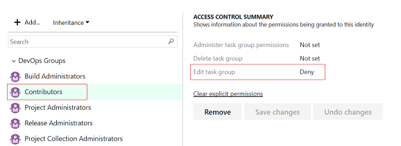

## Get Started

- Introduction

  The following illustrations provide the steps to create a build pipeline based on various MDRLabs Distribution Tasks.

- Installing Extension

  - Navigate to the [Visual Studio Marketplace](https://marketplace.visualstudio.com/azuredevops)
  - Search for '_DES Azure Distribution Tasks_'
  - Install the Azure DevOps Pipeline extension by choosing your organization

       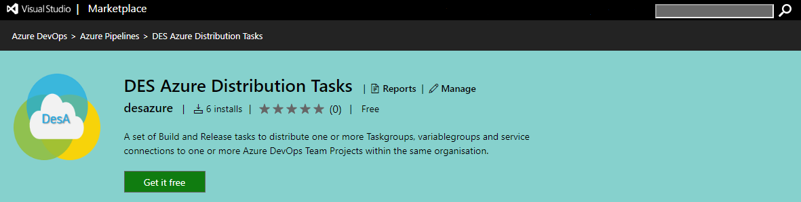

      To install extension on Azure DevOps Cloud instance, select the organization and click on install button. In order to install extension on Azure DevOps On-premises instance click Download button and install it manually. 

       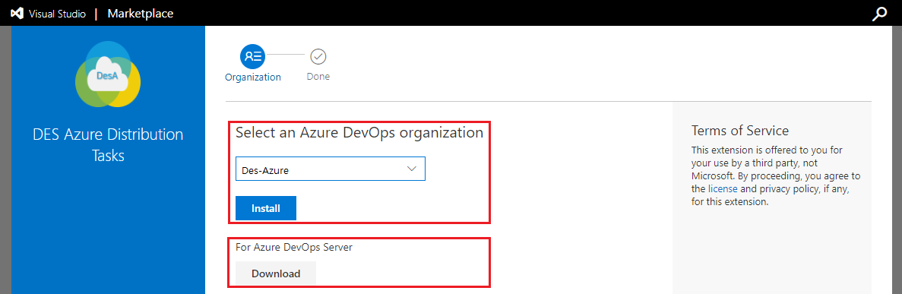

- Create a New Build Pipeline

  - Navigate to the Pipelines -> Build hub and select New Build Pipeline. Use a classic pipeline editor to create build pipeline

       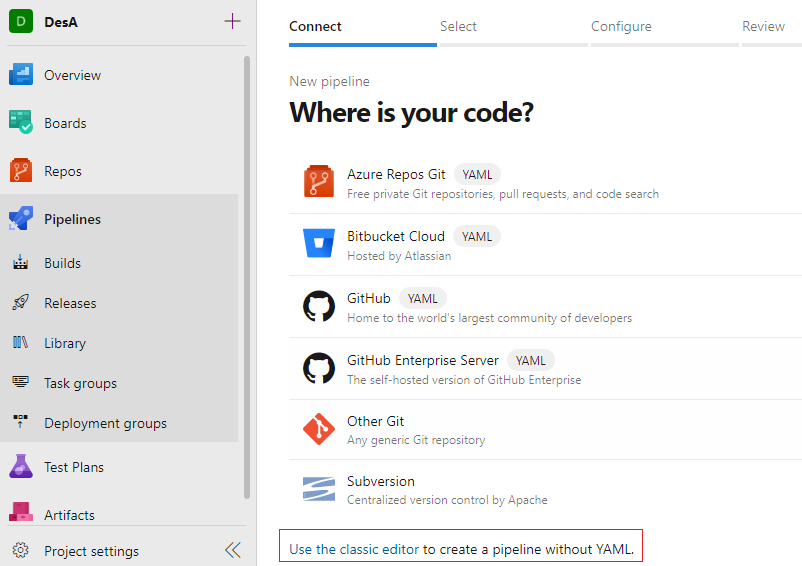

  - Choose your source, team project, code repository, repository branch and click on continue button

       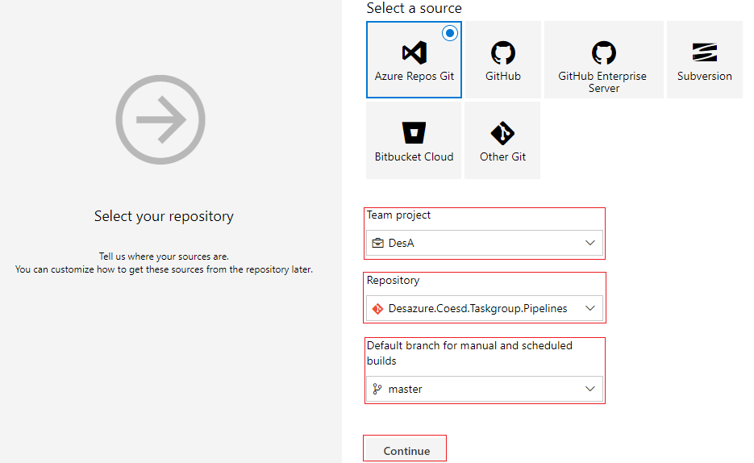

- Choose a Template

  - Select a empty job project template

       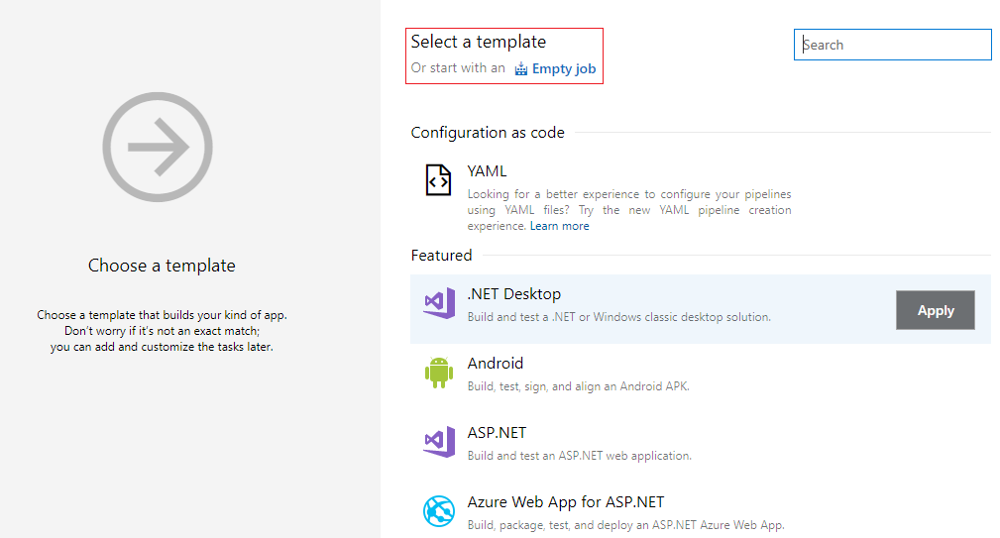

  - Setup Pipeline Agent Job

  - Enter the build pipeline name, agent job and select the agent pool to run the pipeline

       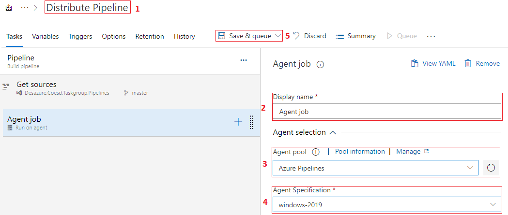

- Add Distribution Tasks

  - Add the distribution tasks by clicking plus(+) button and search the task using keyword 'Distribution'. You will see three tasks to distribute i.e. MDRLabs _Variablegroup Distribution_, MDRLabs _Taskgroup Distribution_ and MDRLabs _Serviceconnection Distribution_. Select the appropriate distribution task in order to distribute within Azure team projects of your organization. It is advised to add the tasks in the following order:

      1. Variablegroups
      1. ServiceConnections
      1. Taskgroups

       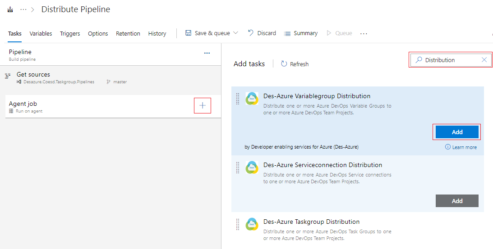

  - After the selection(addition) of distribution task you will see your build pipeline as below

       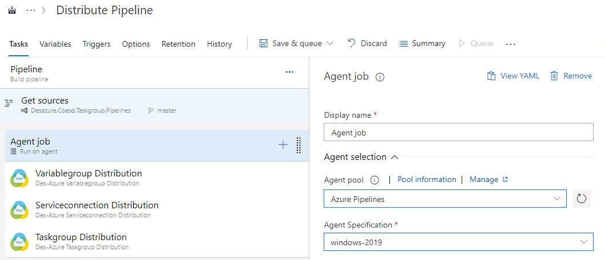

- Configure Pipeline Variable

  - Now, create the build pieline variable Personal Access Token(PAT) by adding parameter `Maintain.Pipeline.Pat`

       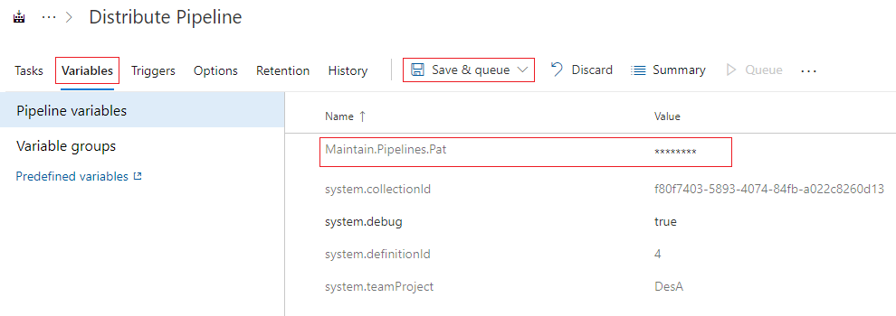

- Get ready to Distribute Tasks

  - Now you are ready to distribute Variablegroup, Serviceconnection and Taskgroup to projects in Azure DevOps of your organization.

## Related Topics

- [Azure DevOps Taskgroups](https://docs.microsoft.com/en-us/rest/api/vsts/distributedtask/taskgroups)
- [Azure DevOps Variablegroups](https://docs.microsoft.com/en-us/rest/api/azure/devops/distributedtask/variablegroups)
- [Azure DevOps Serviceconnection](https://docs.microsoft.com/en-us/rest/api/azure/devops/serviceendpoint/endpoints?view=azure-devops-rest-5.0)

## Release Notes

While maintaining the extension history we have considered only major versions and they are as follows,

- v1.0 – Implemented variable group distribution to azure team projects
- v2.0 – Implemented task group distribution to azure team projects
- v3.0 – Implemented service connection distribution to azure team projects
- v4.0 – Code refactored in variable group for better maintenance and improved documentation
- v5.0 – Implemented version scheme in order to support Major and Minor versions
- v6.0 – Replaced service connection UUID with a variable
- v7.0 – Dynamic service connection and using variable or token based approach
- v8.0 – Functionality to override service connections
- v9.0 – Implemented functionality to display summary report of failed and successful team projects while distributing task groups
- v10.0 – Implemented functionality to set access permissions for a Task group as optional, and made improvements to the documentation
- v11.0 - Improved message handling in the distribute pipelines extension
- v12.0 - Support for Azure DevOps Server

## Contributors

Special thanks to our MDRLabs contributers team

   1. [Michael Bentley](https://nl.linkedin.com/in/michaelrbentley)
   1. [Rohit Nadhe](https://www.linkedin.com/in/rohitnadhe)
   1. [Deepak Deopure](https://nl.linkedin.com/in/deepak-deopure-a3849553)
